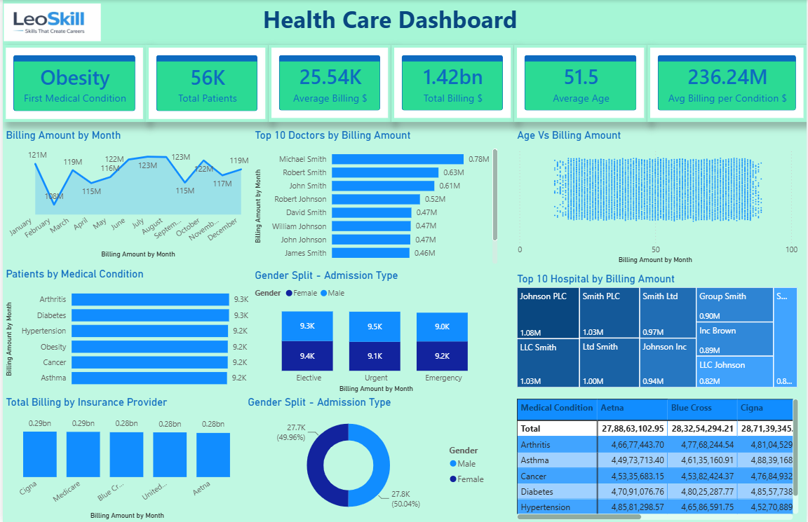

# 🏥 Health Care Dashboard - Power BI

## Project Overview

This project presents an interactive Healthcare Dashboard developed in Microsoft Power BI.

The dashboard provides insights into patient billing, medical conditions, hospitals, insurance providers, doctors, and demographic information using interactive visualizations.

---

## Dashboard Highlights

- Total Patients
- Total Billing Amount
- Average Billing
- Average Patient Age
- Top 10 Doctors by Billing
- Top Hospitals by Billing
- Monthly Billing Trend
- Medical Condition Analysis
- Insurance Provider Analysis
- Gender Distribution
- Admission Type Analysis

---

## Tools Used

- Microsoft Power BI
- Microsoft Excel
- SQL
- Power Query
- DAX

---

## Dataset

Healthcare sample dataset containing:

- Patient Details
- Doctor Information
- Hospital Information
- Billing Details
- Medical Conditions
- Insurance Provider
- Admission Type
- Gender
- Age

---

## Dashboard Preview



---

## Key KPIs

- Total Patients
- Total Billing Amount
- Average Billing
- Average Age

---

## Business Insights

- Obesity is one of the leading medical conditions.
- Billing trends fluctuate throughout the year.
- Insurance providers contribute nearly equal billing amounts.
- Male and Female admissions are almost equally distributed.
- Certain hospitals and doctors generate higher billing revenue.

---

## Repository Structure

```
PowerBI/
Dataset/
Images/
Documentation/
SQL/
README.md
```

---

## Skills Demonstrated

- Data Cleaning
- Data Modeling
- DAX
- Power Query
- Data Visualization
- Dashboard Design
- Business Analytics

---

## Author

Vinod Kumar
